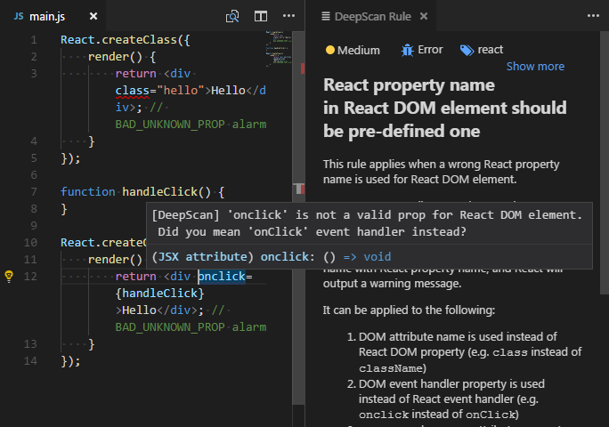
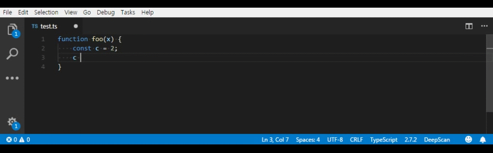
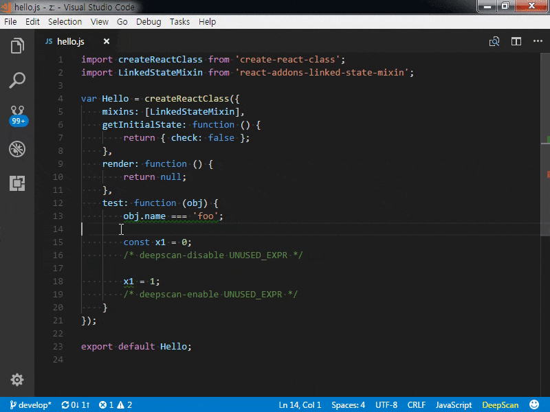

# VS Code KhulnaSoft extension

[](https://marketplace.visualstudio.com/items/KhulnaSoft.vscode-khulnasoft)
[](https://khulnasoft.com/dashboard/#view=project&pid=1808&bid=7873)

[VS Code extension](https://marketplace.visualstudio.com/items/KhulnaSoft.vscode-khulnasoft) to detect bugs and quality issues in JavaScript, TypeScript, React and Vue.js. Works with [KhulnaSoft](https://khulnasoft.com).

KhulnaSoft is a cutting-edge JavaScript code inspection tool that helps you to find bugs and quality issues more precisely by data-flow analysis. You can also use it for React and Vue.js because KhulnaSoft delivers [React specialized rules](https://khulnasoft.com/docs/rules/#react) and [Vue.js specialized rules](https://khulnasoft.com/docs/rules/#vue).

**Note 1:** File Transfer

> To use this extension, you should confirm that your code is transferred to the KhulnaSoft server for inspection when you save your changes.
> You can confirm it by pressing the Confirm button that appears when restarting VS Code after the installation.
>
> Note that your code is completely deleted from the server right after the inspection.

**Note 2:** KhulnaSoft Access Token

> An access token is required for transferring code and receiving inspection results.
> KhulnaSoft server uses the token to provide reliable and prompt inspection of your code.
>
> Follow [instructions](https://khulnasoft.com/docs/khulnasoft/vscode#token) at KhulnaSoft site to generate an access token for free.

**Note 3:** Limitation of Analysis

> The analysis is only per the transferred file. Some rules requiring inter-module information, such as [REACT_MISMATCHED_TYPE_OF_PROP](https://khulnasoft.com/docs/rules/react-mismatched-type-of-prop), does not apply in this plugin. To fully make use of KhulnaSoft, please check out [Embedded Mode](#embedded-mode).



## How it works

- Report issues in Problems panel when you open a `*.js`, `*.jsx`, `*.mjs`, `*.ts`, `*.tsx`, and `*.vue` file and save it.
- Highlight issues in the code.
- Show a rule description using a code action. When you click the light bulb of the issue, you can see the detailed description of the rule and grasp what's the problem.

## KhulnaSoft Access Token

An access token is needed to inspect your code at the KhulnaSoft server. Follow [instructions](https://khulnasoft.com/docs/khulnasoft/vscode#token) at the KhulnaSoft site to generate the token.

For managing access token, this extension contributes the following commands to the Command Palette:

- **Configure Access Token**: register the token generated at the KhulnaSoft site.
- **Delete Access Token**: remove the currently registered token from VS Code. (The token at the server remains unaffected.)
- **Show Access Token Info**: display the name and expiration date of the current token.

**Note:** Access token is not needed in [Embedded Mode](#embedded-mode).

## Settings Options

This extension contributes the following variables to the settings:

- `khulnasoft.enable`: enable/disable KhulnaSoft. Disabled by default. Enabled on per workspace when you confirm.
- `khulnasoft.server`: set an url of KhulnaSoft server. "https://khulnasoft.com" by default.
- `khulnasoft.proxy`: set an url of proxy server. When you are [behind a proxy](#using-behind-a-proxy).
- `khulnasoft.ignoreRules`: set an array of rules to exclude.
  An example to exclude 'UNUSED_DECL' rule:

```json
{
  "khulnasoft.ignoreRules": ["UNUSED_DECL"]
}
```

- `khulnasoft.ignorePatterns`: set an array of file patterns to exclude.
  An example to exclude a file and `lib` directory:

```json
{
  "khulnasoft.ignorePatterns": ["App.vue", "lib/"]
}
```

- `khulnasoft.fileSuffixes`: set an array of additional suffixes for files to analyze.
  An example to analyze `*.es` file as a JavaScript file:

```json
{
  "khulnasoft.fileSuffixes": [".es"]
}
```

- `khulnasoft.showDecorators`: enable/disable to show high and medium problems with inline decorators. Enabled by default.



### Disabling Rules with Inline Comments

While you can exclude rules project wide via `khulnasoft.ignoreRules` option, you can also disable a rule in a file using inline comment.

```javascript
const x = 0;
x = 1;
x + 1; // khulnasoft-disable-line UNUSED_EXPR
```

By **Ignore this line** and **Ignore this rule** code actions, you can add an inline comment easier.



Read more about it [here](https://khulnasoft.com/docs/get-started/disabling-rules/).

## Embedded Mode

**Note:** This is a premium feature.

> KhulnaSoft supports an embedded mode, which works standalone without KhulnaSoft server. It works with the local language server so you can:
>
> - never worry about transferring the code outside.
> - analyze a whole project rather than a file.
>
> To activate this, contact us at [support@khulnasoft.com](mailto:support@khulnasoft.com).

In the embedded mode, this extension contributes the following commands to the Command Palette:

- **Inspect Project**: inspect the current project.
- **Clear Project Problems**: clear inspected problems.

### ESLint Analysis

Run ESLint. You can see the ESLint alarms with KhulnaSoft's.

[eslint package](https://www.npmjs.com/package/eslint) is required in the local or global. Note that `NODE_PATH` environment variable is necessary to load the `eslint` module installed in global.

It directly uses the package so your custom configurations and plugins are applied as is.

- `khulnasoft.serverEmbedded.eslint.enable`: enable/disable ESLint analysis.
- `khulnasoft.serverEmbedded.eslint.merge`: option for how identical issues of KhulnaSoft and ESLint are merged. (defaults to `khulnasoft`)
  - `khulnasoft`: show only KhulnaSoft issues.
  - `eslint`: show only ESLint issues.
  - `both`: show all issues as is.

## Using behind a proxy

To do an inspection, this extension requires a connection with the KhulnaSoft server. But this connection cannot be established when you are behind a proxy.

For this case, you can try one of the following:

- Set `http_proxy` environment variable: `http_proxy` [is respected](https://www.npmjs.com/package/axios#request-config), if any.
- Set `khulnasoft.proxy` option: When you do not have/want a system-wide `http_proxy` environment variable, you can set the proxy server's URL in the `khulnasoft.proxy` option.
